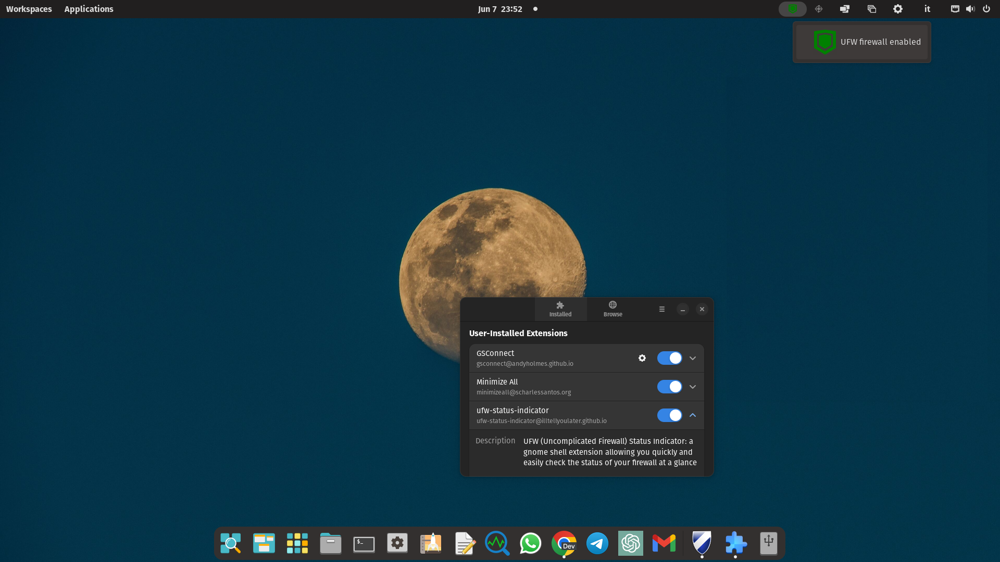
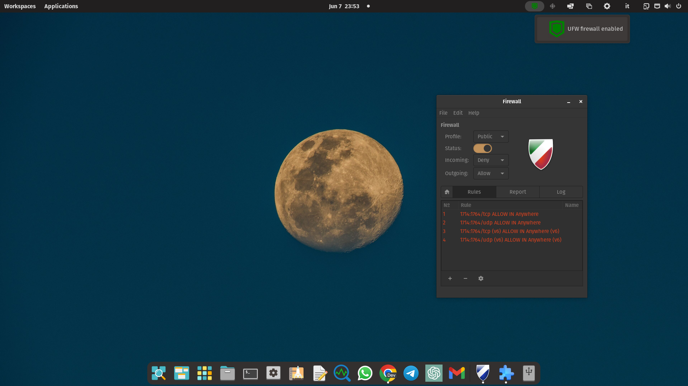
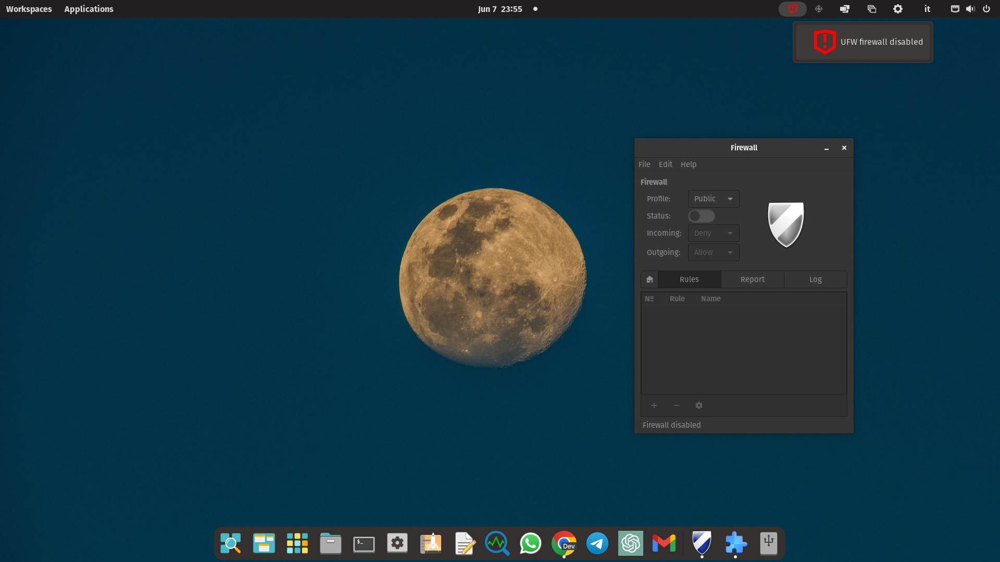

# UFW Status Indicator for GNOME 48

## Credits

All credit goes to [@illtellyoulater](https://github.com/illtellyoulater/) for the original [extension](https://github.com/illtellyoulater/ufw-status-indicator). The original extension is now incompatible with the modern version of GNOME, so I decided to fork it and build a port for GNOME 48 with a few minor additions for myself.

## Updates

### 1. **extension.js**
- Converted all imports to ES6 module syntax
- Created new `UfwStatusIndicatorExtension` class that extends `Extension`
- Moved initialization code into `enable()` and `disable()` methods
- Replaced `imports.byteArray` with `TextDecoder` for file reading
- Added logger functionality using `getLogger()`
- Fixed deprecated `actor` property usage

### 2. **metadata.json**
- Updated `shell-version` to `["48"]`

### 3. **prefs.js**
- Created modern preferences using widgets
- Added setup instructions directly in preferences
- Follows HIG by using libadwaita components

### 4. **Additional Files Created**
- **install.sh** - Added an automated installation script
- **uninstall.sh** - Added an automated uninstallation script
- **stylesheet.css** - Custom styling
- **package.json** - Development and packaging helper
- **.eslintrc.json** - Code quality configuration
- **Makefile** - Development automation

### Logging & Development
The extension now uses the built-in logger for easier debugging. There are also development tools added.

## Installation Process

1. **Prerequisites**
   - GNOME Shell 48
   - UFW (Uncomplicated Firewall) installed
   - Root access for cron job setup

2. **Quick Install**
   ```bash
   # Run the installation script
   bash install.sh
   ```

3. **Manual Install**
   ```bash
   # Copy files to extension directory
   make install
   
   # Set up cron job
   sudo crontab -e
   # Add: * * * * * LC_ALL=C LANGUAGE=C LANG=C ufw status | grep "Status:" > /var/log/ufw-status-indicator.ext.log
   
   # Enable extension
   make enable
   ```

---

# Original README:

---

# ufw Status Indicator: a visual indicator for the Uncomplicated Firewall

ufw Status Indicator is a Gnome Shell extension that provides a nice and reliable visual indicator for the Uncomplicated Firewall (ufw).

It looks like this







and it nicely complements [Gufw](https://github.com/costales/gufw), a beautiful and functional ufw GUI by [@costales](https://github.com/costales/) which is also shown in the above screenshots, and which I highly recommend trying out for a seamless and user-friendly firewall management experience.

## How it works

To enable the extension to function properly, a root cron job is required. This cron job runs the command `ufw status` once every minute and copies the output to `/var/log/ufw-status-indicator.ext.log`. This file is monitored by the extension, and as soon an update is detected it will read the file and change the UFW indicator icon accordingly. 

The log file monitoring is operated by leveraging watchdog capabilities of the GTK Gio library (rather than looping over the file and checking for changes) and this approach contributes to efficient operation of the extension resulting in an almost nonexistent system resources utilization.

If the file `/var/log/ufw-status-indicator.ext.log` is not found by the extension or contains unexpected content, the indicator will turn to orange and clicking on it will provide additional information on the encountered problem.

## Installation

To install the UFW Status Indicator, you need to add a root cron job and then install the extension like you normally would for any Gnome Shell Extension. Here are the steps:

1. Open a terminal and type the following command to edit the root crontab file:

    ```bash
    sudo crontab -e
    ```

2. Add the following line to the crontab file:

    ```bash
    * * * * * LC_ALL=C LANGUAGE=C LANG=C ufw status | grep "Status:" > /var/log/ufw-status-indicator.ext.log
    ```

3. Save and close the file; from now on the extension can be easily installed for any user.

4. Download the extension zip file from the releases section.

5. Extract the zip file to `~/.local/share/gnome-shell/extensions/`, making sure to include the folder containing the extension files (`ufw-status-indicator@ArchLars.github.io`) without changing its name:

    ```bash
    unzip ufw-status-indicator.zip -d ~/.local/share/gnome-shell/extensions/
    ```

6. Enable the extension using your usual extension manager or GNOME Extensions app.

After these steps, the UFW Status Indicator should show up with a green shield icon if UFW is enabled, or a red shield if it's disabled.

